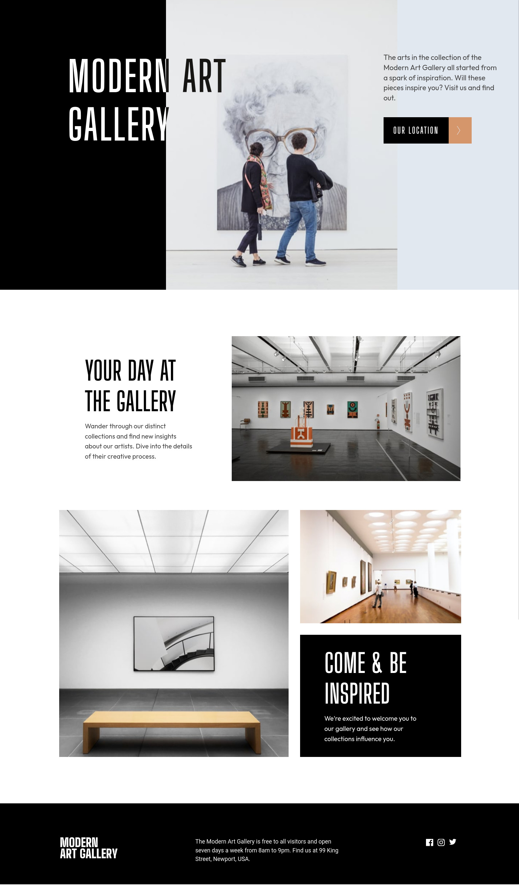

# Frontend Mentor - Art gallery website solution

This is a solution to the [Art gallery website challenge on Frontend Mentor](https://www.frontendmentor.io/challenges/art-gallery-website-yVdrZlxyA). Frontend Mentor challenges help you improve your coding skills by building realistic projects.

## Table of contents

- [Overview](#overview)
  - [The challenge](#the-challenge)
  - [Screenshot](#screenshot)
  - [Links](#links)
- [My process](#my-process)
  - [Built with](#built-with)
  - [What I learned](#what-i-learned)
  - [Continued development](#continued-development)
  - [Useful resources](#useful-resources)
- [Author](#author)
- [Acknowledgments](#acknowledgments)

**Note: Delete this note and update the table of contents based on what sections you keep.**

## Overview

### The challenge

Users should be able to:

- View the optimal layout for each page depending on their device's screen size
- See hover states for all interactive elements throughout the site
- **Bonus**: Use [Leaflet JS](https://leafletjs.com/) to create an interactive location map with custom location pin

### Screenshot



### Links

- Solution URL: [Add solution URL here](https://github.com/ttsoares/art-gallery)
- Live Site URL: [Add live site URL here](https://art-gallery-ten-chi.vercel.app)

## My process

### Built with

- Ionic UI utilities to frame the interface
- TailwindCSS to format the specific detais
- Split large, medium and small sizes is separate files
- [React](https://reactjs.org/) - JS library
- [TailwindCSS](https://tailwindcss.com/) - CSS utility classes
- [Ionic](https://ionicframework.com/) - Render JS code to native APPs to Web, IOS and Android

### What I learned

More learning about the context of React, Tailwind and Ionic.
How to render React components using the window object width propertie. That is a better approach than media qqueryes.

```js
if (typeof window !== "undefined") {
  // Handler to call on window resize
  function handleResize() {
    // Set window width/height to state
    setWindowSize({
      width: window.innerWidth,
      height: window.innerHeight,
    });
  }
}
```

### Continued development

Ionic framework do offer much help to build UIs and style them to Web, IOs and Android, but when a desing must be followed one
will need to make use of Tailwind (or plain CSS) as Ionic format can get in the way.

### Useful resources

- [Use media queries with react hooks](https://www.youtube.com/watch?v=_Dm7jkJ75Zk) - This helped me for XYZ reason. I really liked this pattern and will use it going forward.

## Author

- Website - [Thomas TS](https://buildesign.vercel.app/)
- Frontend Mentor - [@ttsoares](https://www.frontendmentor.io/profile/ttsoares)
- Linkedin - [thomas-soares-6791781b/](https://www.linkedin.com/in/thomas-soares-6791781b/)

## Acknowledgments

[That thread at StackOferflow was very usefull](https://stackoverflow.com/questions/67266495/how-can-i-hide-a-component-in-react-depending-on-the-screen-size)
